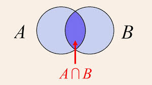

## Breve introdução

Durante minha gradução, a cadeira de probabilidade foi dada de forma muito mecânica, onde apenas apareciam fórmulas mágicas que supostamente calculavam a probabilidade, mas eu não fazia ideia do porque, então fui aos livros estudar e descobri como elas foram construidas e porque funcionavam, e isso me fascinou bastante. Por isso decidi compilar uma versão bem resumida dos meus estudos, para que outras pessoas que já tiveram a mesma experiência que eu, possam ter uma visão geral de como a probabilidade é construída, e porque as fórmulas que aprendemos na graduação funcionam.

Esse material foi construido com base em minhas notas de estudos do livro do Sheldon Ross, "Probabilidade, Um curso moderno com aplicações". Os conteudos aqui apresentados serão com base nos capitulos 1 a 4 do livro, alguns problemas nesse post serão de problemas famosos, e outros serão releitura de alguns exercicios do livro. Recomendo fortemente a leitura dele para quem quiser se aprofundar mais em probabilidade a nível de graduação. Não usarei necessáriamente a mesma notação do livro, e nem as mesmas demonstrações, mas a ideia é a mesma, apenas de uma forma mais resumida e com exemplos mais simples. Na seção de contagem, trarei uma abordagem diferente da do livro, que considero mais intuitiva.

Pré-requisitos: Não é essencial ter feito uma cadeira de probabilidade, ainda que seja interesante. O pré-requisito real aqui é ter uma noção miníma de teoria dos conjuntos. Também é bom ter uma noção de combinatória básica e sobre limites, ainda que não seja essencial.

## O básico sobre contar

Antes de nos adentrarmos em probabilidade, é importante saber contar as coisas, e isso é algo que a maioria das pessoas tem dificuldade, então vamos começar por aqui.

Primeiro de tudo, contar possui dois principios fundamentais, o principio da adição e o principio da multiplicação. O principio da adição diz que se temos dois conjuntos de coisas, e eles não possuem interseção, ou seja, não possuem elementos em comum, então a quantidade total de coisas é a soma das quantidades de cada conjunto. Já o principio da multiplicação diz que se temos um processo que ocorre em etapas, e cada etapa possui uma quantidade fixa de possibilidades, então a quantidade total de possibilidades é o produto das quantidades de cada etapa.

Para formalizar:

- Princípio da adição: Se A e B são conjuntos disjuntos, então |A ∪ B| = |A| + |B|

- Princípio da multiplicação: Se um processo ocorre em n etapas, e cada etapa possui $k_i$ possibilidades, então a quantidade total de possibilidades é $\prod_{i=1}^{n} k_i$

Agora que disse um monte de coisas, vamos por um pouco de intuição nisso. Primeiro sobre o PA (a partir de agora chamarei o principio da adição de PA e o principio da multiplicação de PM), ele é bastante simples, ele funciona da seguinte forma, se precisamos escolher entre coisas mutuamente exclusivas, isso é, escolher uma coisa OU outra, nos somamos as possibilidades. Por exemplo no seguinte problema:

João tem que escolher o que comer, há 3 tipos de sorvete e 2 de bolo, quantas opções de sobremesa ele tem?
$$
3 + 2 = 5 \quad \text{(PA)}
$$

Bastente simples, não?

Agora sobre o principio da multiplicação, ele funciona quando fazemos experimentos (um experimento é um processo onde gera algum resultado entre várias possibilidades) sequenciais, ou seja, quando podemos combinar os resultados de um experimento com o outro. Veja no exemplo abaixo:

João tem que escolher o que comer, há 3 tipos de sorvete e 2 caldas diferentes para colocar no sorvete, quantas opções de sobremesa ele tem?
$$
3 \times 2 = 6 \quad \text{(PM)}
$$

Com esses dois principios, podemos contar quase qualquer coisas, mas ainda são ferramentas muito básicas, abaixo vamos derivar alguns casos especiais que são uteis de saber.

### Permutação

Se temos 3 letras, A, B e C, quantas formas diferentes podemos organizá-las? Pelo principio da multiplicação, na primeia letra temos 3 opções, na segunda letra temos 2 opções (pois já escolhemos uma letra para a primeira), e na terceira letra temos apenas 1 opção (pois já escolhemos as outras duas), então o total de formas diferentes de organizar as letras é:
$$
3 \times 2 \times 1 = 6 \quad \text{(PM)}
$$

As combinações possíveis: ABC, ACB, BAC, BCA, CAB e CBA.

Note que o calculo acima, é o mesmo que calcular o fatorial de 3, ou seja, $3!$. Dessa forma, se temos n objetos distintos, o número de formas diferentes de organizá-los é dado por $n!$.

Ex.1: Quantas formas diferentes podemos organizar as letras da palavra "Claudio"?

Via a formula da permutação, temos que o número de formas diferentes de organizar as letras é dado por $7!$

Agora vamos complicar um pouco as coisas, acima o raciocineo é valido porque todas as letras são distintas, mas e se tivermos letras repetidas? 

Ex.2: De quantas formas diferentes podemos organizar as letras da palavra "Claudia"?

A formula da permutação, não é mais valida, pois a letra a é repetida, se usarmos a formula da permutação, contaremos por exemplo Claudia duas vezes, pois consideramos cada "a" diferente um do outro, ainda que não sejam. Então como resolver? 

O truque consiste em pensar em quantas vezes estamos contando a mesma coisa, nosso objetivo é sempre contar exatamente uma vez cada arranjo (combinação). Então, como temos uma letra só repetida uma unica vez, nós sempre iremos contar a mesma coisa duas vezes, veja abaixo um exemplo:

1. $Cla_1udia_2$
2. $Cla_2udia_1$

Então, para corrigir isso, basta contarmos a permutação total, e dividir por 2:
$$
\frac{7!}{2} \quad \text{(PM)}
$$

Agora, e se tivermos mais de uma letra repetida? Para isso temos a formula geral da permutação com repetição

Permutação com repetição: Se temos n objetos, onde $n_1$ são idênticos, $n_2$ são idênticos, ..., $n_k$ são idênticos, então o número de formas diferentes de organizá-los é dado por:
$$
\frac{n!}{n_1! \times n_2! \times ... \times n_k!} \quad \text{(PM)}
$$

Mas porque é assim? No exercicio anterior, o pensamento de quantas vezes estamos contando a mesma coisa, pode ser pensado sob a ótica de "De quantas formas posssiveis podemos trocar de lugar as letras repetidas sem mudar o arranjo?" Se temos uma letra repetida n vezes, pela permutação, sabemos que há $n!$ formas de trocar de lugar as letras repetidas sem mudar o arranjo. E caso tenhamos mais de uma letra repetida, sabemos pelo PM (pois é um processo sequencial) que o número total de formas de trocar de lugar as letras repetidas sem mudar o arranjo é dado por $n_1! \times n_2! \times ... \times n_k!$. Assim, para corrigir a contagem, basta dividir a permutação total por esse número.

### Combinação

Até agora estavamos nos importanto com a ordem das coisas, mas e se ela não importar?

Ex.3: Quantas formas diferentes podemos escolher 3 pessoas, dentre 10 pessoas para formar um time?

Acredito que seja claro porque a ordem é irrelevante, pois o time formado por João, Maria e José é o mesmo time formado por José, João e Maria. 

Pelo PM, temos:

$$
10 \times 9 \times 8 = 720 \quad \text{(PM)}
$$

times totais importando a ordem, agora basta usar a mesma logica que usamos para permutações repetidas, vamos dividir pela quantidade de vezes que estamos contando esse arranjo a mais, que no caso é o número de formas de eu puxar essas mesmas 3 pessoas em diferentes ordens, ou seja, $3!$ pela permutação. então o resultado final é:

$$
\frac{10 \times 9 \times 8}{3!} = 120
$$

De forma mais geral chamamos isso de combinação: Se temos n objetos distintos, e queremos escolher r deles, sem importar a ordem, então o número de formas diferentes de escolher é dado por:

$$
\binom{n}{r} = \frac{n!}{r! \times
(n-r)!} \quad 
$$ 

Agora já temos um básico da ideia de como contar coisas, então podemos partir para o que realmente interessa, a probabilidade.

## Axiomas da Probabilidade

Antes de irmos para os axiomas, apenas notem que não irei dispor uma definição rigorosa sobre o que é uma probabilidade, apesar de tratarmos dela com rigor. Não fiz isso, pois depende de Teoria da Medida para uma definição formal, matéria essa que ainda não sou versado, e para além disso, esse post tem como objetivo ser uma primeiro vislumbre sobre probabilidade formal nível de graduação, enquanto Teoria da Medida geralmente só é estudada em Pós-Graduação. Porém, caso queira dar uma olhada em uma definição rigorosa de probabilidade, recomendo o video [Aula 01 Probabilidades](https://www.youtube.com/watch?v=mS0hak04rZs&list=PLjCdqxwexy0kE8UNSqoyOqyKGvx9fFWHH) do exclente professor da USP, Cláudio Possani. Para seguirmos, simplesmente consideraremos probabilidade como uma função sobre um evento (Um conjunto) que representa a chance desse evento acontecer.

Um axioma nada mais é do que o conjunto de regras básicas que irá regir como usamos probabilidades, dessa forma, eles não envolvem demonstrar algo, nós simplesmente acreditamos/aceitamos que eles sejam verdade. Esses são conhecidos como os axiomas de Kolmogorov:

1) $0 \le P(E) \le 1$,    onde E é um evento (usaremos E como evento geralmente)

2) $P(S) = 1$,   S é o espaço amostral inteiro, isso é, o cojunto de todos os eventos possiveis.

3) $P\left(\bigcup_{i=1}^{\infty} E_i\right)=\sum_{i=1}^{\infty} P(E_i)$

Todos os 3 axiomas são bastante razoaveis, o primeiro diz que uma probabilidade é um valor entre 0 e 1, caso não esteja acostumado a ver probabilidade como por exemplo 0.55, e sim como 55%, saiba que é a mesma coisa, pois % é utilizado como sinonimo de divisão por 100.

O segundo axioma nos diz, que a probabilidade de algo no espaço amostral ocorrer é igual a 1. Como exemplo, pense em jogar um dado de 6 lados, digamos que definimos os eventos como o numero que cair no dado, então teremos $E_1, E_2, E_3, E_4,E_5,E_6$. Onde cada um desses é representado abaixo
$$
\begin{aligned}
E_1 &= \{1\} \\
E_2 &= \{2\} \\
E_3 &= \{3\} \\
E_4 &= \{4\} \\
E_5 &= \{5\} \\
E_6 &= \{6\}
\end{aligned}
$$

Assim, dizemos que o evento $E_1$ aconteceu quando o dado caiu 1, mas e o evento S? Simples, ele é representado como $S = \{1,2,3,4,5,6\}$, ou seja, para qualquer valor que o dado cair, cai em algum valor de S, portanto S ocorre. Logicamente, o axioma diz para nos que a probabilidade de *algo* acontecer é igual a 1.

O terceiro parece muito mais assustador, mas ele não é complicado, ele apenas diz que se os eventos são mutuamente exclusivos, isso é $A \cap B = \varnothing$, a probabilidade da união deles é igual a soma das probabilidades. Vamos novamente para o lançamento de um dado, ele necessariamente vai cair no valor de 1 a 6, a probabilidade de cair em cada valor é de 1/6, eles são mutamente exclusivos pois se cair x no dado não pode ter caido nenhum outro valor. Então, via o axioma 3, temos que a probabilidade de cair 1 ou 2, é equivalente a 2/6, veja a conta abaixo: 
$$
\begin{aligned}
P(E_1 \cup E_2) &= P(E_1) + P(E_2) \\
P(E_1 \cup E_2) &= \frac{1}{6} + \frac{1}{6} \\
P(E_1 \cup E_2) &= \frac{2}{6} = \frac{1}{3}
\end{aligned}
$$

Com isso temos a base das regras de como a probabilidade funciona. Entretanto, essas regras por si só não são muito poderosas, por isso, vamos provar dois teoremas simples e intuitivos antes de irmos resolver alguns exemplos.

### Teorema 1
Definição:
$$
P(E^c) = 1 - P(E)
$$

Prova:

$$
\begin{aligned}
&E^c \cup E = S \\
&P(E^c) + P(E) = P(S) \quad \text{(via Axioma 3)} \\
&P(E^c) + P(E) = 1 \quad \text{(via Axioma 2)} \\
&P(E^c) = 1 - P(E)
\end{aligned}
$$ 

Esse teorema basicamente permite que calculemos a probabilidade do complementar de um evento, então se sabemos por exemplo que a probabilidade de dar cara em determinada moeda é de 0.6, sabemos agora que a de não dar cara é de 0.4. Note que não posso afirmar que a probabilidade de dar coroa é de 0.4 sem fazer a suposição de que é impossivel que a moeda caia de pé (por mais que seja razoavel desprezar essa probabilidade na maior parte dos casos).

### Teorema 2
Definição:
$$
P(A \cup B) = P(A) + P(B) - P(A \cap B)
$$

Prova:

$$
\begin{aligned}
&B = (A \cap B)\cup (A^c \cap B) \\
&P(B) = P(A \cap B) + P(A^c \cap B) \quad \text{Via axioma 3}\\
&P(A^c \cap B) = P(B) - P(A \cap B)\\
\end{aligned}
$$

Do resultado acima obtemos: $P(A^c \cap B) = P(B) - P(A \cap B)$
Com ele agora podemos finalizar a prova

$$
\begin{aligned}
&A \cup B = A \cup (A^c \cap B) \\
&P(A \cup B) = P(A) + P(A^c \cap B) \quad \text{Via axioma 3} \\
&P(A \cup B) = P(A) + P(B) - P(A \cap B) \quad \text{Usando o resultado acima}\\
\end{aligned}
$$

Agora que está provado, temos mais uma regra bem poderosa, que nos permite calcular probabilidade de união de eventos que não são mutuamente exclusivos. A intuição do porque essa formula funciona é bastante simples, veja o diagrama abaixo

{#fig-vein width=70%}

Se quisermos cacular a área de $A \cup B$  teriamos que somar a área de A, a área de B e subtrair a intersecção deles ( $A \cap B$ ), pois teriamos somado aquela área duas vezes, estamos apenas retirando o que contamos a mais. Esse é exatamente a mesma lógica da nossa formula, cálculamos a probabilidade de A ocorrer mais a de B, mas nisso estariamos "contando" duas vezes os casos onde A e B ocorrem juntos, por isso subtraímos $P(A \cap B)$

### Alguns problemas

Temos em uma linha, 4 bolas vermelhas, 8 azuis e 5 verdes alinhadas aleatóriamente

A) Qual a probabilidade de que as primeiras 5 bolas sejam azuis?

A = Evento em que as 5 primeiras sejam azuis

A estratégia mais simples para esse problema, envolve pensar em um problema equivalente. Vamos supor que eu vá retirar 5 bolas de uma urna que contem as mesmas bolas da linha, qual a probabilidade de tirar as 5 primeiras como azuis? Note que é exatamente o mesmo problema, pois podemos pensar que toda vez que eu tiro da urna, eu posso colocar na linha, portanto a quantidade de combinações na linha é igual as de retirada da urna.

Dessa forma, podemos usar combinatória para calcular quantidade de termos tanto do denominador, quanto do numerador:

$$
P(A) = \frac{\binom{8}{5}}{\binom{17}{5}} = \frac{2}{221}
$$

Uma duvida completamente justa que você pode estar tendo é, porque usamos combinação se o problema claramente depende de ordem, sendo que combinação (como demonstrado anteriormente) é para casos onde a ordem dos termos é irrelevante?

Embora a ordem das bolas na linha importe, podemos usar combinações porque contar diretamente todas as configurações da linha exigiria lidar com repetições (bolas da mesma cor são indistinguíveis).

Por exemplo, o número total de linhas possíveis seria:

$$
\frac{17!}{4!8!5!}
$$

e o número de casos favoráveis, onde as 5 primeiras bolas são azuis, seria:

$$
\frac{12!}{4!3!5!}
$$

Logo,

$$
P(A)=
\frac{\frac{12!}{4!3!5!}}
{\frac{17!}{4!8!5!}}
$$

que, após simplificar, é equivalente a:

$$
P(A)=\frac{\binom{8}{5}}{\binom{17}{5}}.
$$

Portanto, usar combinações é apenas uma forma mais simples de fazer essa contagem, pois os fatores relacionados à ordem e às repetições já são considerados automaticamente.

B) Qual a probabilidade de que nenhuma das 5 primeiras seja azul?

A = Evento em que nenhuma das 5 primeiras sejam azuis

De forma equivalente a última, ao inves de calcular considerando o conjunto das azuis, consideramos todas menos as azuis

$$
P(A) = \frac{\binom{9}{5}}{\binom{17}{5}} = \frac{9}{442}
$$

C) Qual a probabilidade de que as três últimas bolas tenham cores diferentes?

A = Evento em que as três últimas bolas tenham cores diferentes

Nesse caso, é mais simples utilizar diretamente os princípios de contagem. 

$$
P(A) = \frac{8 \cdot 5 \cdot 4}{17 \cdot 16 \cdot 15} \cdot 3! = \frac{4}{17}  \quad \text{via PM}
$$

Note que multiplicamos por $3!$ porque, ao calcular

$$
\frac{8}{17}\cdot\frac{5}{16}\cdot\frac{4}{15},
$$

estamos considerando apenas uma ordem específica das cores nas três últimas posições, por exemplo: azul, verde e vermelha.

Entretanto, o evento de interesse não exige uma ordem específica, apenas que as três últimas bolas tenham cores diferentes. Como as três cores podem aparecer em qualquer uma das

$$
3! = 6
$$

ordens possíveis, e essas ordens são mutuamente exclusivas, basta multiplicar a probabilidade de uma ordem específica por $3!$.

Se não fizéssemos essa multiplicação, estaríamos calculando apenas a probabilidade de uma única sequência de cores, e não a probabilidade de que as três últimas bolas tenham cores diferentes em qualquer ordem.

Além disso, gaste um tempo para se convencer de porque esse problema é identico a calcular a probabilidade considerando as 3 primeiras, e não as 3 últimas

D) Qual é a probabilidadde de que todas as bolas vermelhas estejam juntas?

A = Evento em que todas as bolas vermelhas estejam juntas

Para esse problema, podemos usar um raciocínio diferente, podemos pensar que as bolas vermelhas, são uma unica entidade, vamos pensar nas 4 vermelhas como uma unica bola vermelha, afinal só estamos interessados em cálcular a chance de estarem juntas

$$
P(A) = \frac{14!}{17!} \cdot 4! = \frac{7}{120}  \quad \text{via PM}
$$

Da mesma forma que no exemplo C, temos que multiplicar o numerador pela quantidade de permutações possiveis entre os próprios vermelhos.

Note que nesses exemplos, sempre me dei ao trabalho de definir claramente qual era o evento em que eu estava cálculando, sempre define o A. Para esses exemplos, isso pode parecer preciosimo matemático, e realmente é. Entretanto, para problemas mais complexos, é muito fácil se perder nos cálculos se não definir direito seus eventos. Por tanto, mesmo que seja chato, SEMPRE defina claramente seus eventos. A importancia disso ficará mais clara quando chegarmos em probabilidade condicional, mas já é bom tornar isso um hábito.

W.I.P.